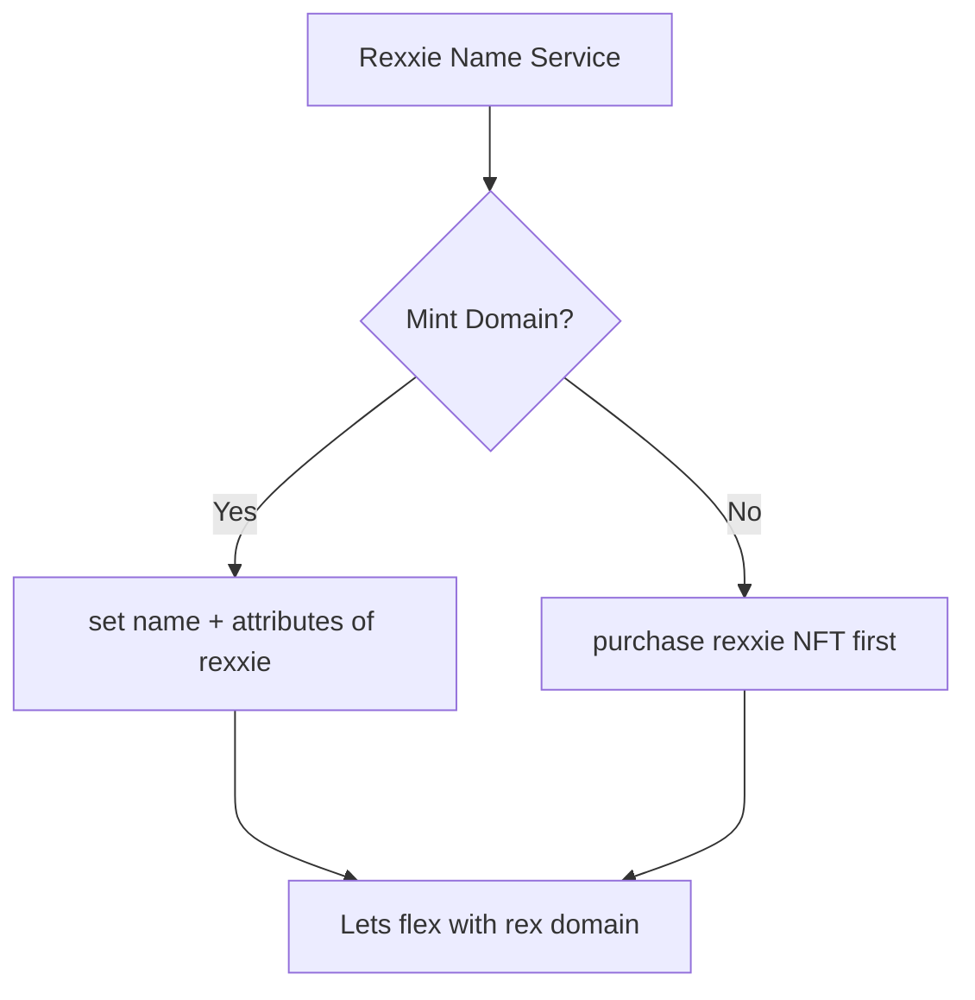

# TGC rexxie domain builder v1

mumbai contract address 
```
0x07A277fB9d3Ed8433632Ce04ebD4AF2C2fb5F688
```

modified
```
0x79A8690F116161E80c657Ce95126aE7542e3A997
```

genesis domain NFT: 
```
https://testnets.opensea.io/assets/mumbai/0x07a277fb9d3ed8433632ce04ebd4af2c2fb5f688/0
```

mod Rexxie NFT Domain:
```
https://testnets.opensea.io/collection/rexxie-service-name-v3
```


